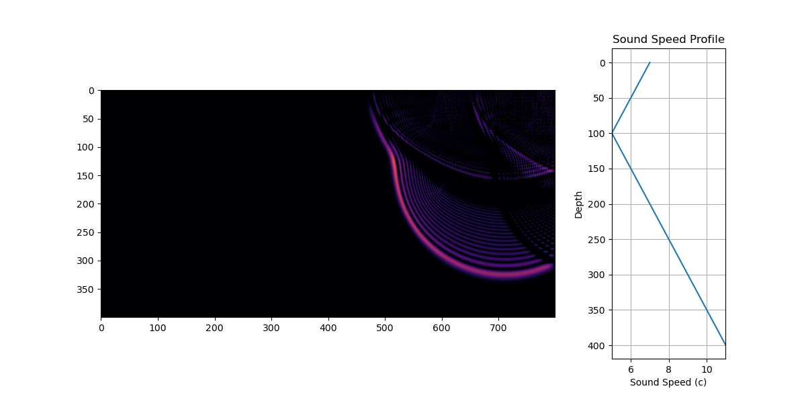
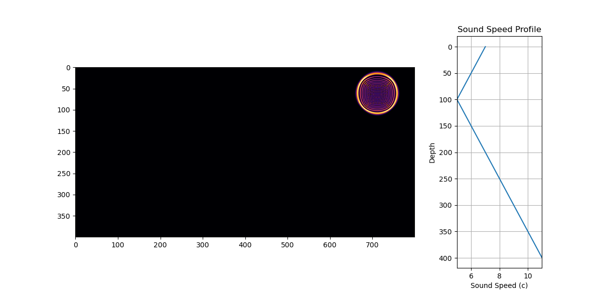

# wave_simulation

Simulation the wave equation in 2D in an inhomogenous medium, inhomogenous means that the speed of the wave changes depending on the position in the medium, e.g the propagation of sound in an oceanic environment or seismic activity. Motivation: This project is intended to be a learning experience for me.

The simulation uses a 2D grid to model the behavior of waves as they propagate across an inhomogeneous medium. The key objective is to simulate how waves behave and observe emerging patterns. Meaning, where are they going, how are they reflecting, are there areas where the waves focus?

$$
\frac{\partial^2 u(x, y, t)}{\partial t^2} = c^2(x, y) \left( \frac{\partial^2 u(x, y, t)}{\partial x^2} + \frac{\partial^2 u(x, y, t)}{\partial y^2} \right)
$$

Where:
- $(u(x, y, t))$ is the wave field, representing the displacement of the medium at location $(x, y)$ and time $t$,
- $(c(x, y))$ is the variable wave speed at location $(x, y)$,
- $(\frac{\partial^2}{\partial t^2})$ is the time second derivative,
- $(\frac{\partial^2}{\partial x^2})$ and $(\frac{\partial^2}{\partial y^2})$ are the spatial second derivatives.

The simulation also handles boundary conditions, where the behavior of the wave at the edges of the simulation grid is modified to reflect realistic physical environments, including the implementation of Perfectly Matched Layer (short PML) to prevent wave reflections. Tho this not as simple as I thought it to be. I realize that waves still reflect no matter how I treat the boundary with a PML. I am still gradually learning.

Spatial Discretization, aka the nifty math of turning the PDE into something approximated, that can be simulated on a big grid

We define a grid with a step size $ dx $ and $ dy $ in the $x$- and $y$-directions. Using a second-order finite difference approximation for the spatial derivatives, we approximate the wave equation as:

$$
\frac{\partial^2 u(x, y, t)}{\partial x^2} \approx \frac{u(x + dx, y, t) - 2u(x, y, t) + u(x - dx, y, t)}{dx^2}
$$

$$
\frac{\partial^2 u(x, y, t)}{\partial y^2} \approx \frac{u(x, y + dy, t) - 2u(x, y, t) + u(x, y - dy, t)}{dy^2}
$$

Time Discretization

For the time derivative, we use a central difference approximation:

$$
\frac{\partial^2 u(x, y, t)}{\partial t^2} \approx \frac{u(x, y, t + dt) - 2u(x, y, t) + u(x, y, t - dt)}{dt^2}
$$

Where:
- $(dt)$ is the time step,
- $(dx)$ and $(dy)$ are the spatial step sizes.

Thus, the numerical update for each point in the grid at time $(t+dt\$ becomes:

$$
u(x, y, t + dt) = 2u(x, y, t) - u(x, y, t - dt) + r^2 \left[ u(x + dx, y, t) + u(x - dx, y, t) + u(x, y + dy, t) + u(x, y - dy, t) - 4u(x, y, t) \right]
$$

Where $(r = \frac{c(x, y) \cdot dt}{dx})$ is the stability parameter that depends on the wave speed $(c(x, y))$ and the spatial resolution $(dx)$. Numerical stability is achieved by ensuring that $(r \leq 1)$, i.e., the Courant-Friedrichs-Lewy (CFL) condition must be satisfied, else the numerical stability will be unhappy :(

Problems:
- Numerical Instability: The numerical simulation may suffer from instabilities if the time step $(dt)$ or the spatial resolution $( dx, dy )$ are not chosen appropriately. The CLF condition must be followed to ensure stability in the wave propagation.

- Boundary Reflections: Reflection artifacts occur at the boundaries of the grid, but these reflections interfere with the wave propagation in the interior of the grid, creating unnatural interference patterns. I was trying to reduce reflections with a dampening of the waves close to the boundaries trying to implement a perfectly matched layer PML

- Perfectly Matched Layer (PML) is implemented to avoid these reflections, I am still seing numerical reflections at PML, i'd rather comment this part of the code

- Performance Issues: i mean the evaluation is slow, each "frame" is calculated in the update functions and runs the code execution through the UI. A smarter approach would first calculate all simulation values, and then run a smooth visualization in a video or gif

Good Ressources that helped:
- [the WikiPedia article about the wave eqation](https://en.wikipedia.org/wiki/Wave_equation)
- [Nils Berglund's presentation about boundary conditions ](https://www.youtube.com/watch?v=pN-gi_omIVE)
- your favorite LLM to get a quick starter on the math needed
- other helpful knowlege about Taylor series and Euler method or Runge-Kutta-method are helpful for the understanding of the math

The plot above shows the initial pulse

The second plot displays the **wave front** as it propagates inhomogeneous medium, the waves will bend accordingling, and converge to zones with a lower propagation speed

This little project achieved my goal of learning how the wave equation can be modeled. I did another project that uses ray tracing to simulate the refraction of waves in an inhomogeneous medium, especially to discover shadow zones with high damping in sonar applications. Future projects should solve the boundary conditions so waves can leave the simulation domain without any reflections or artifacts that keep interfering with the simulation.

I am interested in how these insights here can be scaled to the same problem for electromagnetic waves to simulate the radiation pattern of antennas in 3D.